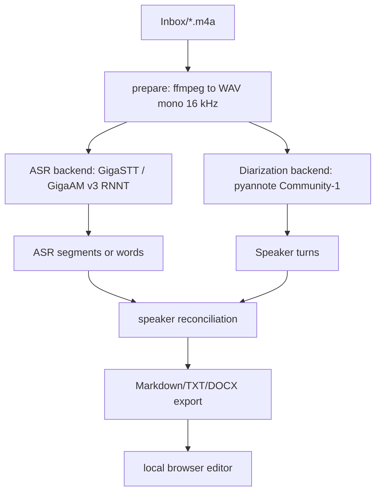

# Architecture

## First Prototype

The first prototype is intentionally pipeline-first. UI comes after the audio and model behavior is measurable on real files.

## Why This Shape

- Long recordings need resumable intermediate files.
- ASR and diarization should be swappable because Russian ASR quality and speaker separation quality will evolve independently.
- The first quality benchmark should run on the user's real iPhone recordings, not on toy samples.
- The web UI should edit a structured transcript, not own the recognition logic.

## Near-Term Backends

- ASR: current backend is `gigastt-gigaam-v3`; next candidates are Handy GigaAM V3 and Handy Whisper Large v3 once their runtimes are integrated.
- Diarization: pyannote Community-1 first, then SpeakerKit/Core ML if pyannote is too slow on Apple Silicon.
- Baseline: whispermlx or installed Whisper Large V3 Turbo for comparison.
