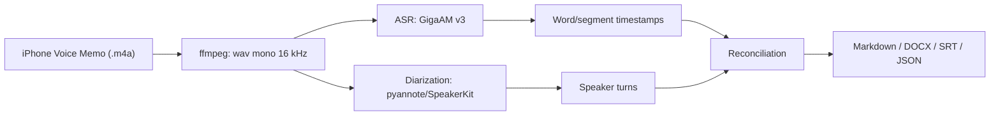

# Research Notes

Дата первичного ресерча: 2026-06-25.

## Короткий вывод

Для русского языка основным кандидатом на ASR выглядит GigaAM v3: модель открытая, ориентирована на русский, поддерживает варианты с пунктуацией и нормализацией текста. Диаризацию лучше держать отдельным этапом: pyannote Community-1 сейчас выглядит самым практичным open-source вариантом, а на Apple Silicon дополнительно интересны Swift/Core ML и MLX-порты.

## Кандидаты

### GigaAM v3

Источник: https://github.com/salute-developers/GigaAM

Плюсы:

- MIT-лицензия.
- Ориентация на русский язык.
- Варианты `v3_e2e_ctc` и `v3_e2e_rnnt` поддерживают пунктуацию и нормализацию.
- Есть word-level timestamps и ONNX export.

Риски:

- `.transcribe` ограничен короткими аудио; для long-form нужен дополнительный пайплайн/VAD.
- Для длинных интервью все равно понадобится собственная сегментация и склейка.

### GigaAM v3 ONNX / onnx-asr / gigastt

Источники:

- https://huggingface.co/istupakov/gigaam-v3-onnx
- https://github.com/ekhodzitsky/gigastt

Плюсы:

- Полностью локальный рантайм через ONNX Runtime.
- Меньше Python-зависимостей в варианте `gigastt`.
- Потенциально хорошая скорость и простая интеграция как сервер/библиотека.

Риски:

- Нужно проверить качество на наших реальных диктофонных записях.
- Встроенная offline diarization в `gigastt 2.5.0` на первом тесте упала с ошибкой формы входа speaker-модели, поэтому диаризацию все равно нужно проверять отдельным backend.
- `download --prequantized` в `gigastt 2.5.0` требует локального symlink workaround для `transcribe`, иначе команда пытается скачать FP32 encoder.

### pyannote Community-1

Источники:

- https://github.com/pyannote/pyannote-audio
- https://huggingface.co/pyannote/speaker-diarization-community-1

Плюсы:

- Специализированный open-source toolkit для speaker diarization.
- Community-1 запускается локально после загрузки модели.
- Есть exclusive diarization, что упрощает совмещение с ASR-таймкодами.

Риски:

- Для загрузки модели нужны Hugging Face token и acceptance условий.
- На Mac нужно отдельно проверить скорость CPU/MPS/Core ML вариантов.

### WhisperX / whispermlx

Источники:

- https://github.com/m-bain/whisperX
- https://github.com/KalebJS/whispermlx

Плюсы:

- Готовая связка ASR + alignment + diarization.
- whispermlx использует MLX и Apple Silicon GPU.
- Хороший baseline для сравнения пайплайна.

Риски:

- Whisper может уступать GigaAM v3 на русских диктофонных сценариях.
- Все равно использует pyannote для диаризации.

### whisper.cpp

Источник: https://github.com/ggml-org/whisper.cpp

Плюсы:

- Зрелый локальный движок.
- Core ML на Apple Silicon может ускорять encoder.
- Хорош для устойчивого офлайн-Whisper.

Риски:

- Нет полноценной диаризации из коробки.
- Для русского качества нужно сравнивать с GigaAM v3.

### Argmax SpeakerKit

Источник: https://github.com/argmaxinc/argmax-oss-swift

Плюсы:

- On-device speaker diarization на Apple Silicon через Core ML.
- Подходит для будущего нативного macOS/iOS приложения.

Риски:

- Для первого прототипа может быть тяжелее, чем Python-пайплайн.
- Нужно проверить зрелость API и качество на наших аудио.

### Готовые приложения как ориентир

Источники:

- MacWhisper speaker recognition: https://macwhisper.helpscoutdocs.com/article/32-automatic-speaker-recognition-in-macwhisper
- WhisperDesk: https://pvas-development.github.io/whisperdesk/

Плюсы:

- Можно быстро понять ожидаемый UX: импорт, таймлайн, правка спикеров, экспорт.
- Полезны как baseline, чтобы не строить лишнее.

Риски:

- Может не дать нужное качество русского ASR.
- Может быть труднее автоматизировать и дорабатывать под наш процесс.

### daowolf/transcribe

Источник: https://gitverse.ru/daowolf/transcribe

Плюсы:

- Уже реализует идею GigaAM + pyannote + пунктуация + LLM-постобработка.
- Есть daemon-режим для папки входящих файлов.
- Полезен как пример склейки pyannote-сегментов и ASR по ролям.

Риски:

- Заточен под Docker/Linux/NVIDIA, а у нас macOS Apple Silicon.
- Использует GigaAM v2 и старые зависимости.
- Монолитный GUI/скрипт, который сложнее развивать под наш UX.

Вывод: использовать как референс, но не как основу кодовой базы.

## Предлагаемая архитектура прототипа

## Критерии успеха

- На интервью 2 человек большая часть реплик правильно отнесена к собеседникам.
- Текст на русском требует минимальной ручной правки.
- Один час аудио обрабатывается предсказуемо и без ручного вмешательства.
- Результат удобно читать, править и использовать в рабочих документах.
- После установки моделей запись не покидает компьютер.
